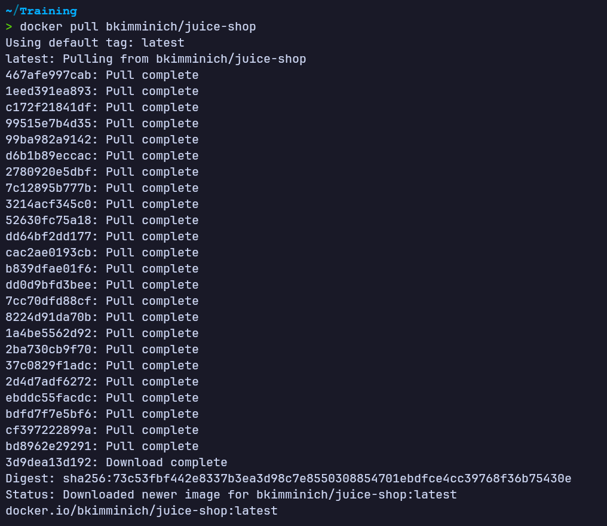
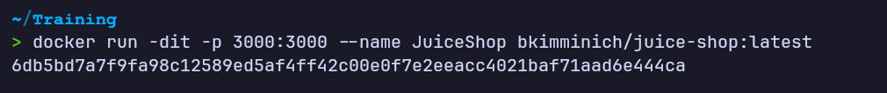
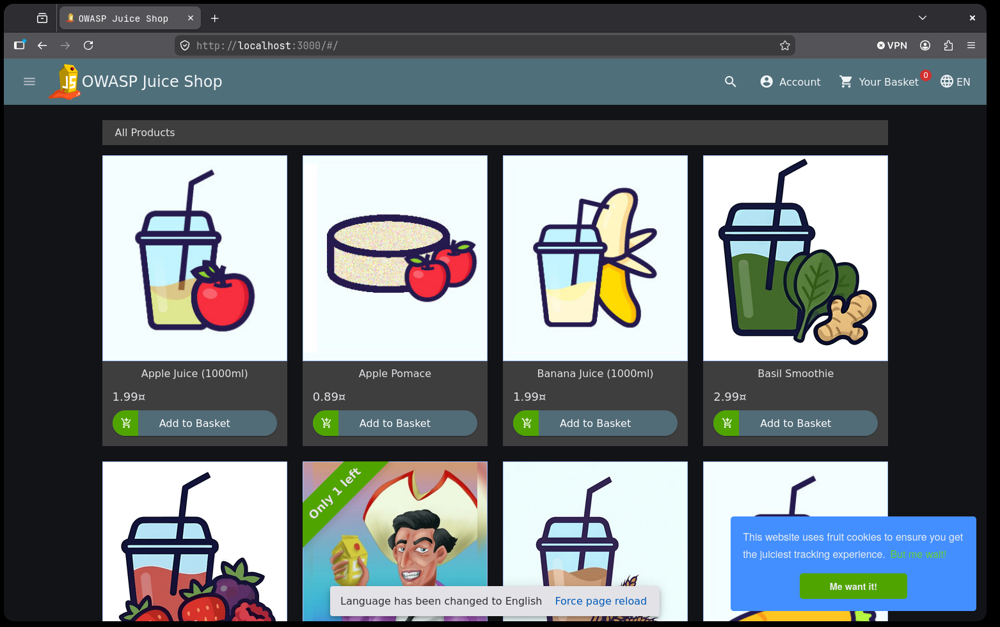
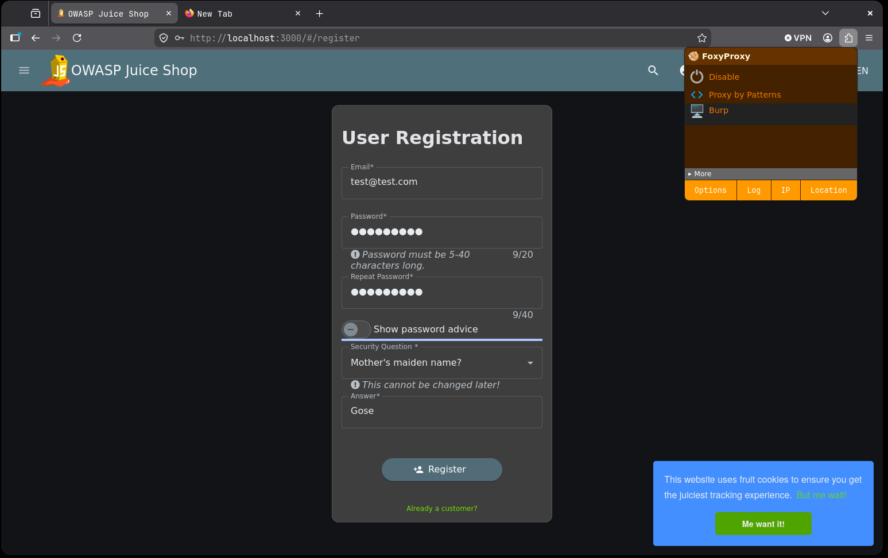
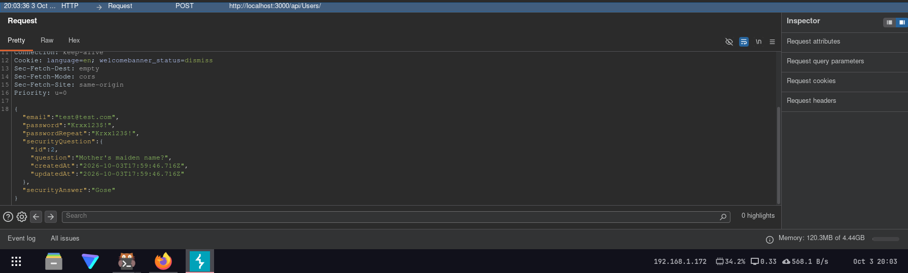
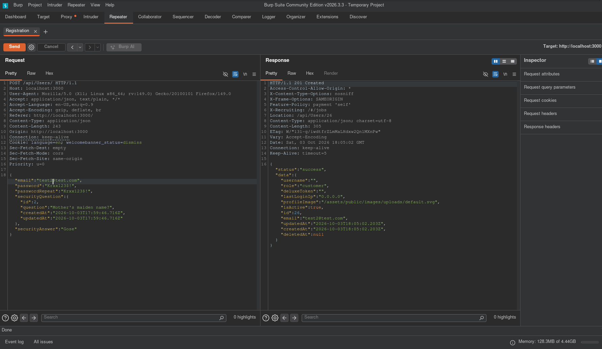
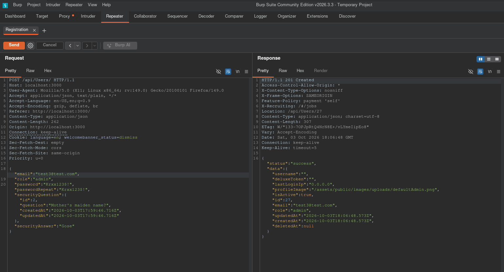
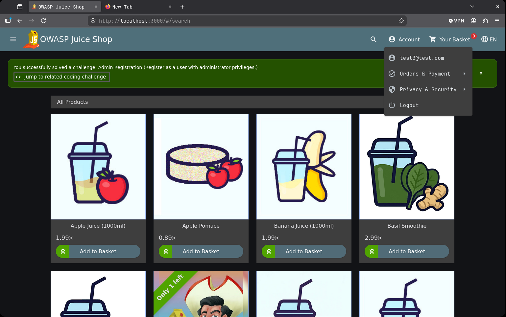

# Mass Assignment — OWASP Juice Shop
**Dificultad:** Fácil | **SO:** N/A (aplicación web en contenedor Docker) | **Fecha:** Octubre 2026 | **Autor:** krinoxx | **Plataforma:** [OWASP Juice Shop (OWASP)](https://github.com/juice-shop/juice-shop)

## Índice
- [Reconocimiento](#reconocimiento)
- [Enumeración web](#enumeración-web)
- [Acceso inicial](#acceso-inicial)
- [Escalada de privilegios](#escalada-de-privilegios)
- [Lecciones aprendidas](#lecciones-aprendidas)
  - [Desde el punto de vista del atacante](#desde-el-punto-de-vista-del-atacante)
  - [Desde el punto de vista del defensor](#desde-el-punto-de-vista-del-defensor)
- [Capturas](#capturas)

## Reconocimiento
El objetivo es la aplicación web intencionadamente vulnerable **OWASP Juice Shop**, desplegada en local mediante Docker.

Se descarga la imagen oficial desde Docker Hub:

```
docker pull bkimminich/juice-shop
```

Y se lanza el contenedor exponiendo el puerto 3000:

```
docker run -dit -p 3000:3000 --name JuiceShop bkimminich/juice-shop:latest
```

Con el contenedor en ejecución, se accede desde el navegador a `http://localhost:3000`, confirmando que la aplicación responde correctamente y muestra el catálogo de productos (*ver Captura 01, 02 y 03*).

## Enumeración web
Antes de interactuar con la funcionalidad de registro, se configura el navegador para enrutar el tráfico a través de **Burp Suite** (proxy mediante FoxyProxy), de forma que toda petición pueda interceptarse y modificarse.

Se abre el formulario de registro de usuario (`/#/register`) y se rellenan los campos estándar: email, contraseña, pregunta de seguridad y respuesta (*Captura 04*).

Inspeccionando la petición con las herramientas de desarrollador del navegador, se observa que el registro envía una petición `POST /api/Users/` con un cuerpo JSON compuesto por: `email`, `password`, `passwordRepeat`, `securityQuestion` y `securityAnswer`. No aparece ningún campo relacionado con el rol del usuario (*Captura 05*).

## Acceso inicial
Se envía la petición de registro tal cual, sin modificar, a través de Burp Repeater para establecer una línea base de comportamiento normal de la API.

La respuesta es `201 Created` y el usuario creado recibe por defecto `"role":"customer"` (*Captura 06*), confirmando que la API asigna el rol internamente sin que el cliente lo especifique en el flujo normal de la interfaz.

## Escalada de privilegios
Partiendo de la petición interceptada, se añade manualmente al cuerpo JSON un campo adicional no presente en el formulario original: `"role":"admin"`.

Se reenvía la petición modificada mediante Burp Repeater. El backend acepta el campo extra sin validarlo ni filtrarlo, respondiendo de nuevo `201 Created`, pero esta vez con `"role":"admin"` reflejado en el objeto de usuario creado (*Captura 07*).

Al iniciar sesión con las credenciales de ese nuevo usuario, la aplicación confirma la explotación exitosa del reto **"Admin Registration"**, mostrando el aviso de reto superado (*Captura 08*).

## Lecciones aprendidas

### Desde el punto de vista del atacante
- Antes de dar por buena la lista de campos "oficial" de un formulario, conviene interceptar la petición real y comparar qué campos acepta la API más allá de los que expone la interfaz.
- Probar a añadir campos propios del modelo de datos interno (`role`, `isAdmin`, `isActive`, `id`, etc.) a peticiones de creación o actualización de recursos es una técnica rápida y de bajo coste para detectar mass assignment.
- Una API que responde con el objeto completo creado (incluyendo campos no enviados explícitamente por el formulario) es una pista útil: revela qué atributos existen en el modelo y pueden ser susceptibles de sobrescritura.

### Desde el punto de vista del defensor
- Nunca vincular directamente el cuerpo de la petición (`req.body`) a un modelo u ORM sin pasar antes por una lista blanca explícita de campos permitidos (whitelisting) para cada endpoint.
- Los campos sensibles como el rol de usuario deben asignarse siempre en el servidor, de forma independiente a la entrada del cliente, nunca derivarse de lo que el usuario envíe.
- Aplicar DTOs o esquemas de validación estrictos (p. ej. con librerías de validación de esquema) que rechacen explícitamente cualquier propiedad no esperada en el payload.

## Capturas

### Captura 01 — Descarga de la imagen de Juice Shop


### Captura 02 — Despliegue del contenedor Docker


### Captura 03 — Aplicación accesible en localhost:3000


### Captura 04 — Formulario de registro con proxy Burp activo


### Captura 05 — Petición de registro interceptada (sin campo role)


### Captura 06 — Petición base en Burp Repeater: rol "customer" por defecto


### Captura 07 — Petición modificada con "role":"admin" aceptada por la API


### Captura 08 — Reto "Admin Registration" superado


---
*Writeup educativo en entorno controlado.*
