# Open Redirect — SKF Labs
**Dificultad:** Progresiva (fácil → difícil) | **SO:** Linux (Node.js/Express) | **Fecha:** 04/10/2026 | **Autor:** krinoxx | **Plataforma:** [skf-labs (blabla1337)](https://github.com/blabla1337/skf-labs)

## Índice
- [Reconocimiento](#reconocimiento)
- [Enumeración web](#enumeración-web)
- [Acceso inicial](#acceso-inicial)
- [Escalada de privilegios](#escalada-de-privilegios)
- [Lecciones aprendidas](#lecciones-aprendidas)
  - [Desde el punto de vista del atacante](#desde-el-punto-de-vista-del-atacante)
  - [Desde el punto de vista del defensor](#desde-el-punto-de-vista-del-defensor)
- [Capturas](#capturas)

## Reconocimiento
El laboratorio corresponde al módulo **"Unvalidated URL redirections"** del repositorio *skf-labs*, dentro de `nodeJs/`. Existen tres variantes progresivas del mismo reto, cada una con un filtro de entrada más estricto que la anterior:

- `Url-redirection` — versión base, sin ninguna sanitización sobre el parámetro.
- `Url-redirection-harder` — bloquea el carácter `.` en el valor recibido.
- `Url-redirection-harder2` — bloquea tanto `.` como `/`.

Cada variante se levanta en local con `npm install && npm start`, arrancando un servidor Express con `nodemon` en el puerto `5000` (*Captura 01*). El tráfico se intercepta con **Burp Suite Community Edition**, configurando FoxyProxy en el navegador para enrutar las peticiones a través del proxy local.

## Enumeración web
La página principal del lab (*Captura 02*) expone un único punto de interés: un botón **"Go to new website"** que dispara una petición `POST /redirect` con un parámetro `newurl`. Interceptando esa petición en el Proxy de Burp se confirma el endpoint vulnerable (*Captura 03*):

```
POST /redirect?newurl=/newsite HTTP/1.1
Host: localhost:5000
```

La respuesta es un `302 Found` con cabecera `Location` igual al valor de `newurl`, sin validar que el destino sea una ruta relativa de la propia aplicación — la firma clásica de un **Open Redirect (CWE-601)**.

## Acceso inicial

### Variante base (`Url-redirection`)
Sin filtro alguno, basta con sustituir el valor del parámetro por una URL externa directamente desde la barra de direcciones:

```
http://localhost:5000/redirect?newurl=https://google.es
```

(*Captura 04*). El servidor responde con `Location: https://google.es` y el navegador completa la redirección hacia Google sin ninguna advertencia (*Captura 05*).

### Variante `harder` (bloqueo de ".")
Al repetir el mismo payload contra esta variante, la aplicación responde con una página de error personalizada: **"Sorry, you cannot use '.' in the redirect"** (*Captura 08*). Se intenta evadir el filtro codificando el punto como `%2e` desde el menú contextual de Burp (*Captura 09*), pero el servidor decodifica el valor antes de aplicar la validación y el bypass sigue bloqueado (*Captura 10*).

### Variante `harder2` (bloqueo de "." y "/")
Esta versión añade el carácter `/` a la lista negra: **"Sorry, you cannot use '.' or '/' in the redirect. Good luck!"** (*Captura 12*). Doblar la codificación del `/` (`%252f`) tampoco es suficiente, porque tras un único decode del lado servidor el carácter `/` sigue presente y el filtro lo detecta (*Captura 13*).

El punto de inflexión llega al analizar cómo interpreta el **navegador** (no el servidor) una cabecera `Location` que contiene un esquema sin las barras `//` tras los dos puntos. Un payload con `%2f%2f` codificado hace que el propio navegador, al no reconocer un esquema `http(s)` bien formado, trate la cadena como una ruta **relativa** y la solicite contra el servidor local, devolviendo un `404` (*Captura 14*):

```
GET /htpps:%2f%2fgoogle%2ees HTTP/1.1
Host: localhost:5000
```

La solución consiste en eliminar por completo las barras del payload y confiar en que el analizador de URLs del navegador (especificación WHATWG) normaliza automáticamente los esquemas especiales (`http`/`https`) insertando `//` aunque no estén presentes en el texto original. Combinando esto con el punto codificado como `%2e`, el valor enviado al servidor nunca contiene literalmente `.` ni `/`, pasando el filtro:

```
POST /redirect?newurl=https:google%2ees HTTP/1.1
```

El servidor acepta el valor y devuelve `302 Found` con `Location: https:google%2ees` (*Captura 15*). Al seguir la redirección en el navegador real, este reconstruye la URL como `https://google.es` y completa la navegación hasta Google con éxito (*Captura 16*), confirmando el bypass del filtro más restrictivo de las tres variantes.

## Escalada de privilegios
No aplica — se trata de una vulnerabilidad puramente de aplicación web (Open Redirect) sin componente de sistema operativo ni de post-explotación.

## Lecciones aprendidas

### Desde el punto de vista del atacante
- Un Open Redirect rara vez se considera crítico en solitario, pero es una pieza habitual en cadenas de phishing, bypass de OAuth/SSO y exfiltración de tokens vía `Referer`.
- Los filtros basados en listas negras de caracteres (`.`, `/`) aplicados **antes** de decodificar la entrada son triviales de evadir si el *parser* de URLs del cliente (navegador) es más permisivo que la validación del servidor.
- Conocer las particularidades del estándar WHATWG URL (normalización automática de `//` en esquemas especiales como `http`/`https`) permite construir payloads que superan validaciones aparentemente robustas.
- Burp Repeater + el menú de "Convert selection → URL encode" agiliza mucho la iteración manual de bypass de filtros.

### Desde el punto de vista del defensor
- Nunca confiar en el valor de un parámetro de redirección tal cual: usar **listas blancas** de rutas o dominios permitidos, no listas negras de caracteres.
- Aplicar cualquier validación **después** de decodificar completamente la entrada (y de forma recursiva, por si hay doble codificación).
- Si se necesita redirección externa, forzar siempre un esquema y host explícitos y comparar contra un dominio conocido, en vez de intentar "limpiar" la cadena recibida.
- Añadir una página intermedia de confirmación ("vas a salir de este sitio hacia X") mitiga el impacto incluso si el filtro técnico falla.

## Capturas

**Captura 01 — Arranque del servidor (Url-redirection)**
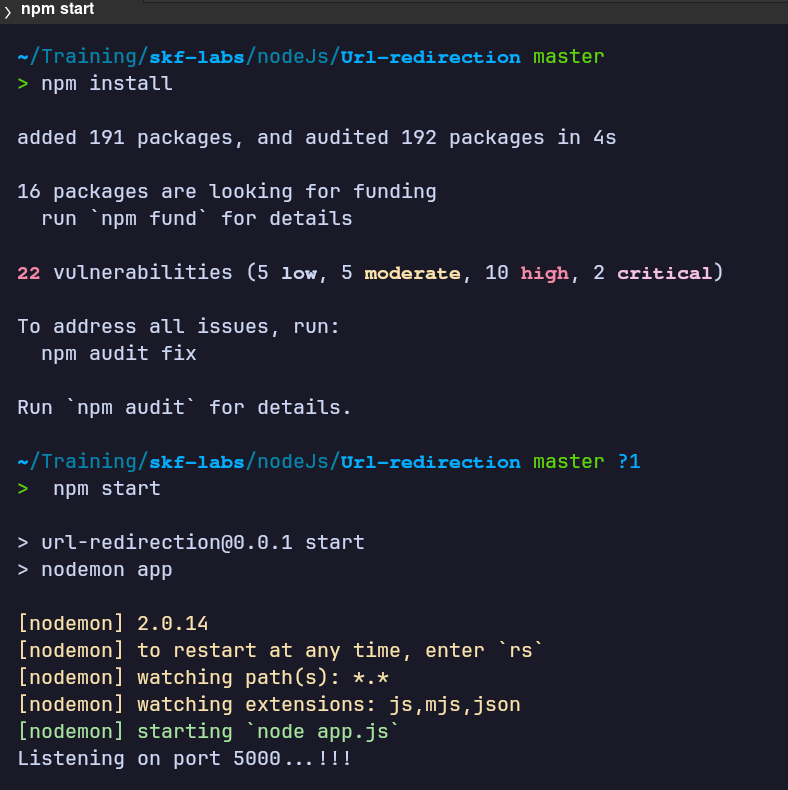

**Captura 02 — Página inicial del laboratorio**
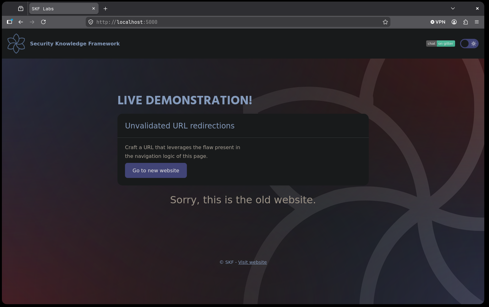

**Captura 03 — Petición interceptada en Burp Proxy (`newurl=/newsite`)**
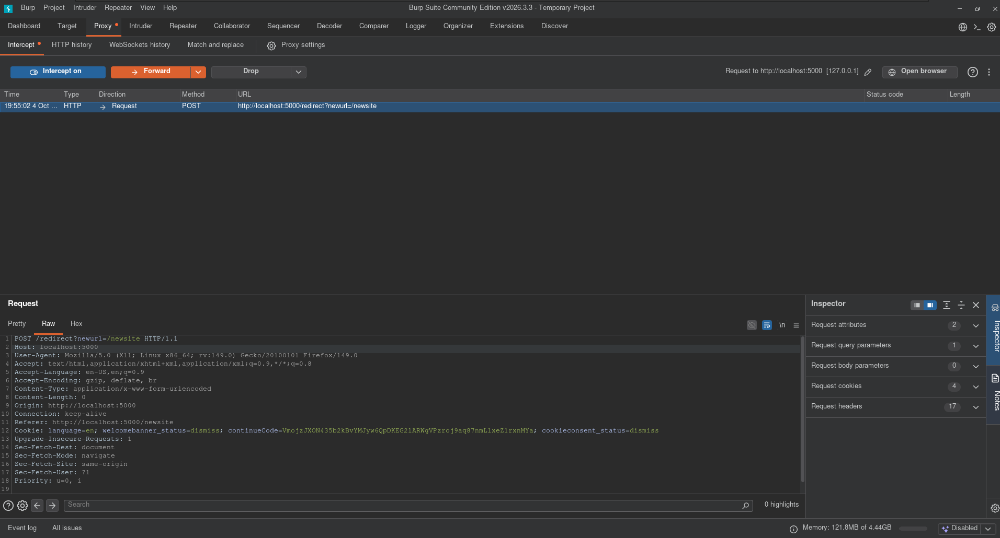

**Captura 04 — Payload directo en la barra de direcciones**
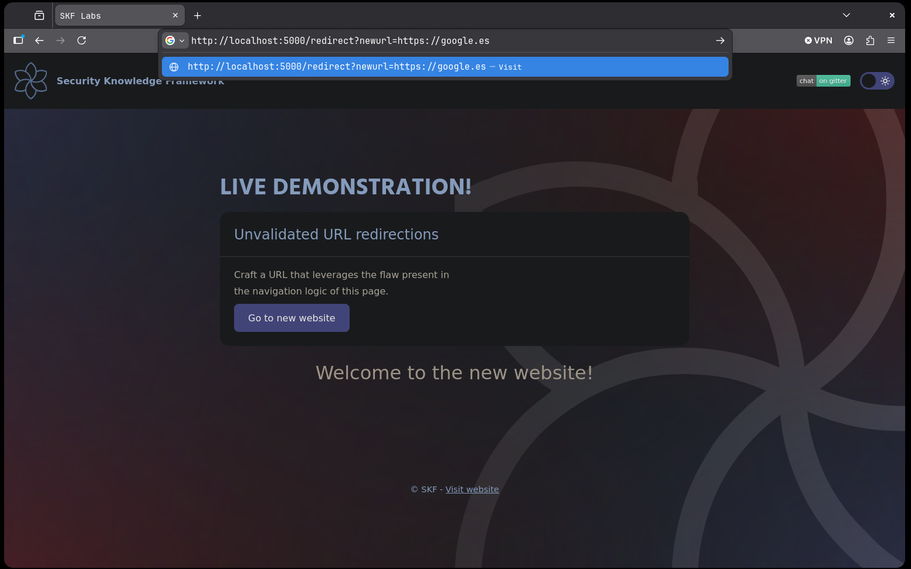

**Captura 05 — Redirección exitosa a Google (versión base)**
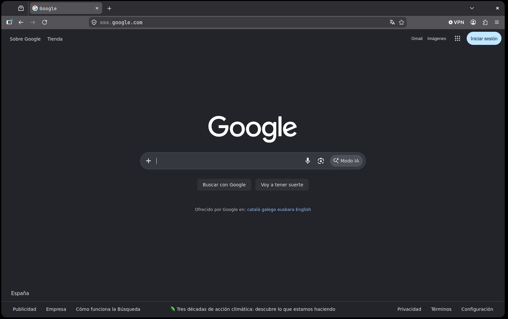

**Captura 06 — Arranque del servidor (Url-redirection-harder)**
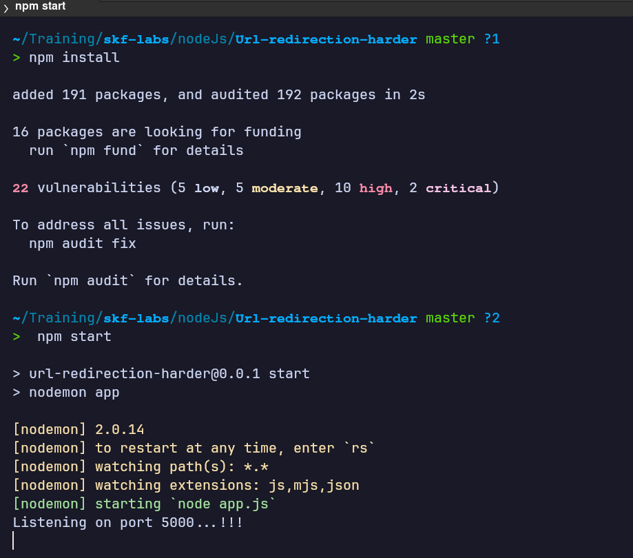

**Captura 07 — Verificación de `/newsite` con el proxy activo**
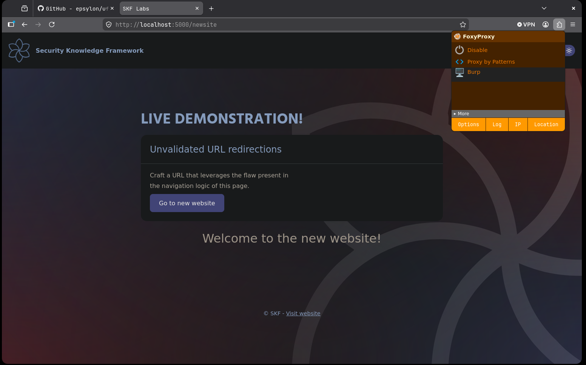

**Captura 08 — El filtro "harder" bloquea el carácter "."**
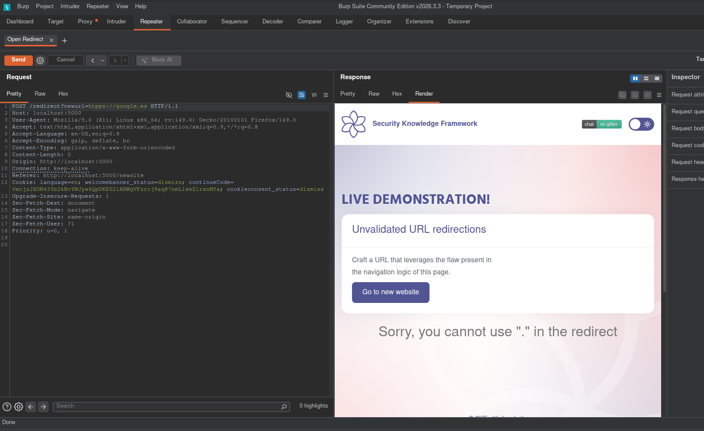

**Captura 09 — Codificación del punto vía menú contextual de Burp**
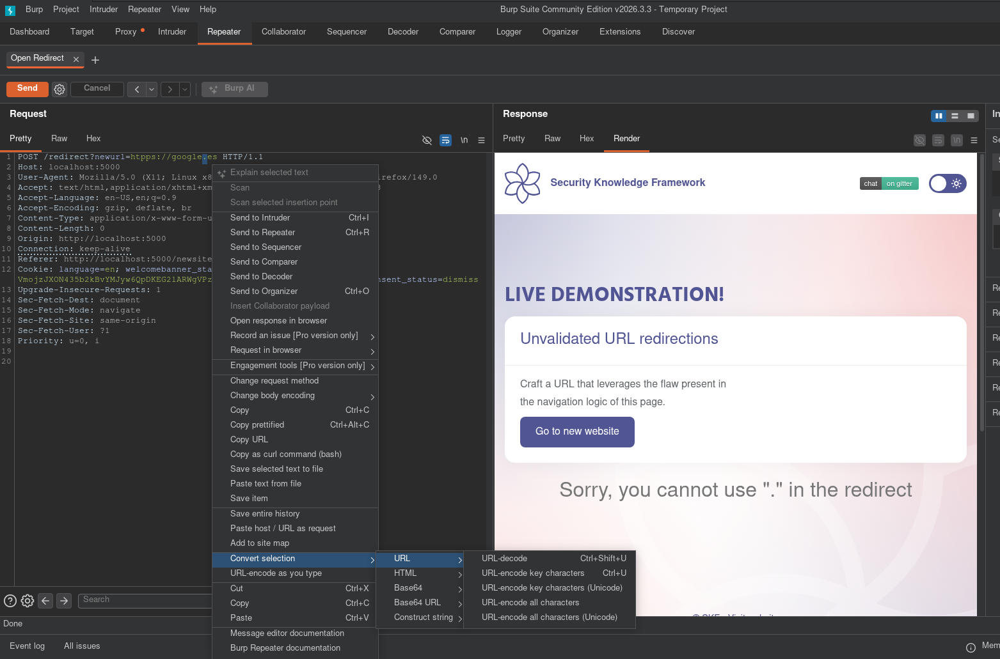

**Captura 10 — `%2e` sigue bloqueado tras decodificar en servidor**
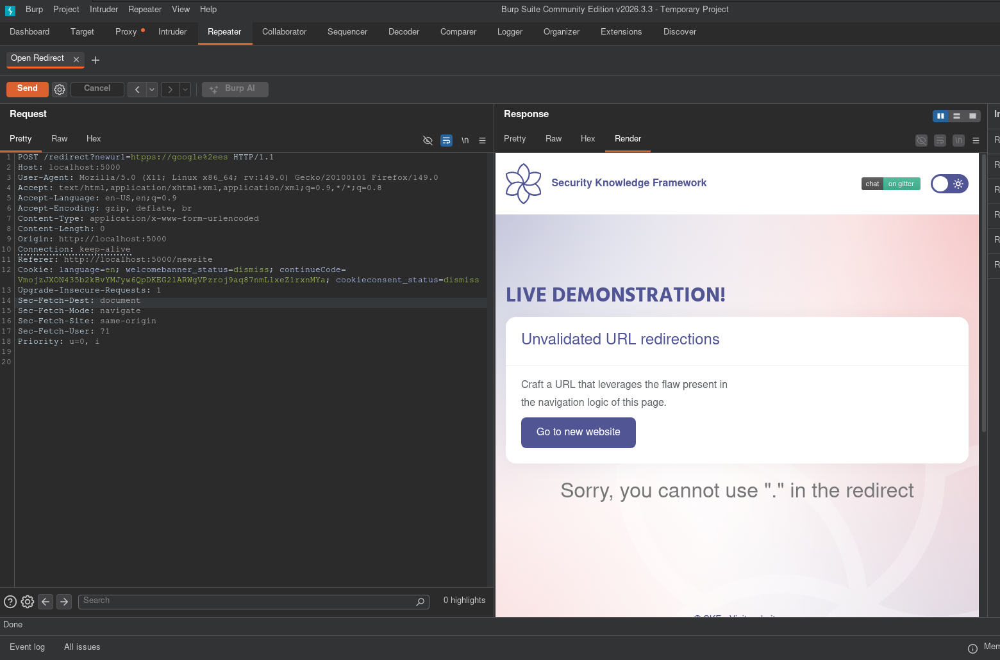

**Captura 11 — Arranque del servidor (Url-redirection-harder2)**
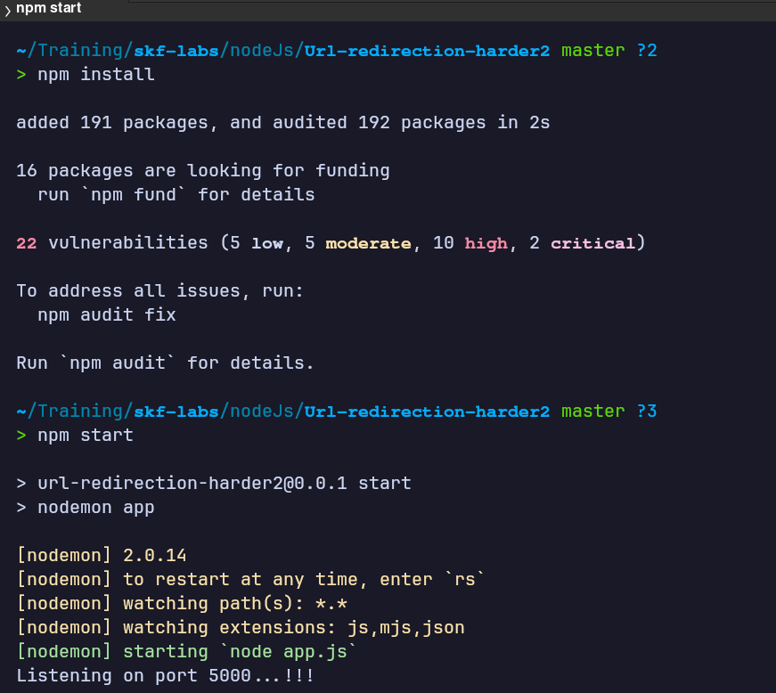

**Captura 12 — El filtro "harder2" bloquea "." y "/"**
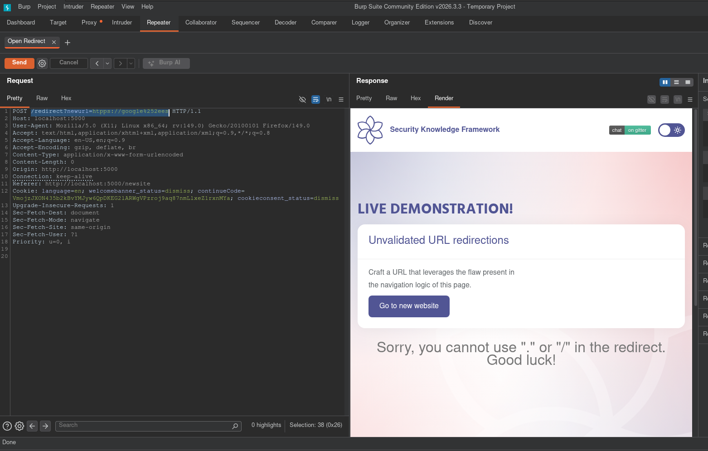

**Captura 13 — Doble codificación de "/" también bloqueada**
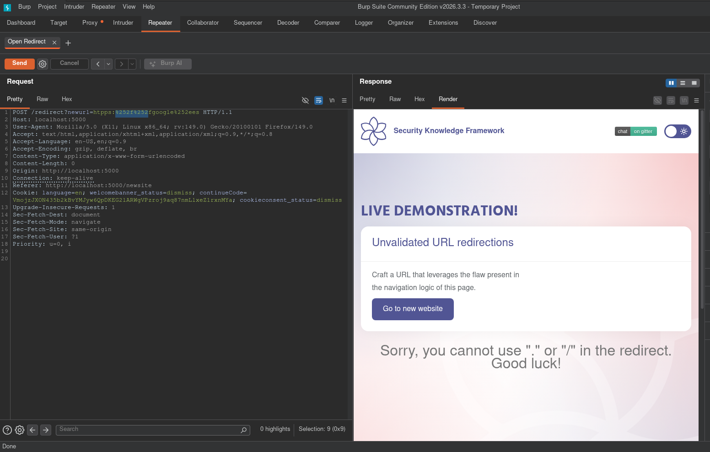

**Captura 14 — El navegador trata el payload con barras codificadas como ruta local (404)**
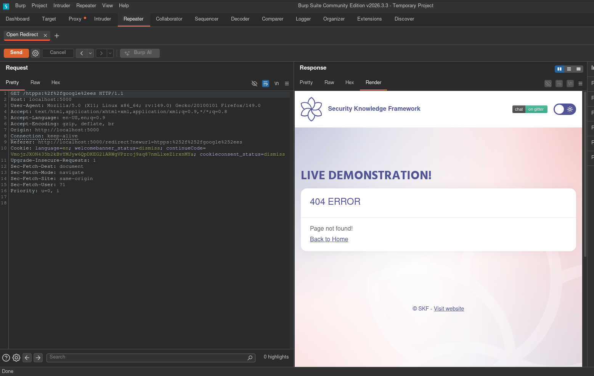

**Captura 15 — Payload final sin barras aceptado por el servidor (302)**
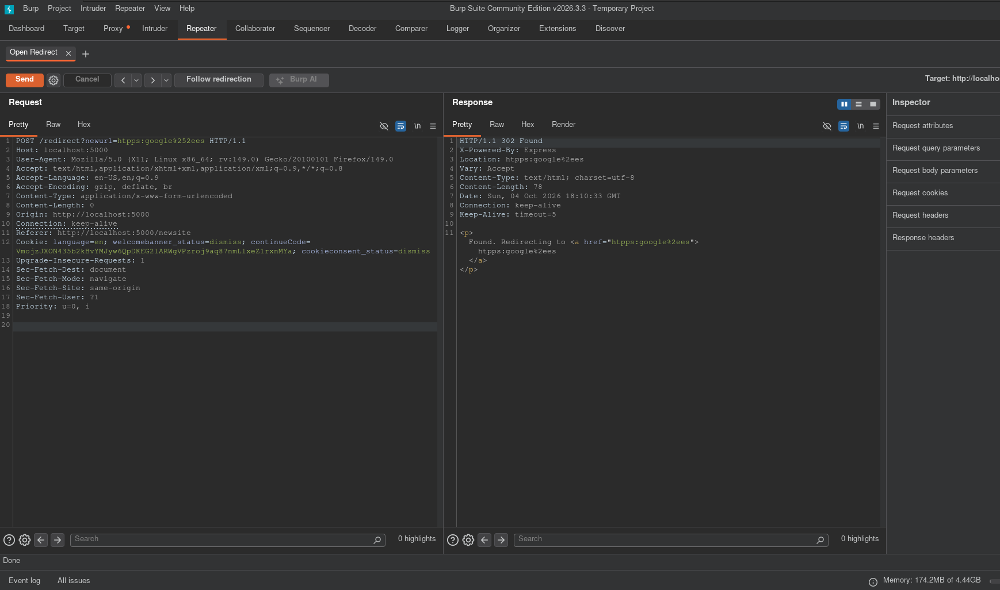

**Captura 16 — Redirección final exitosa a Google**
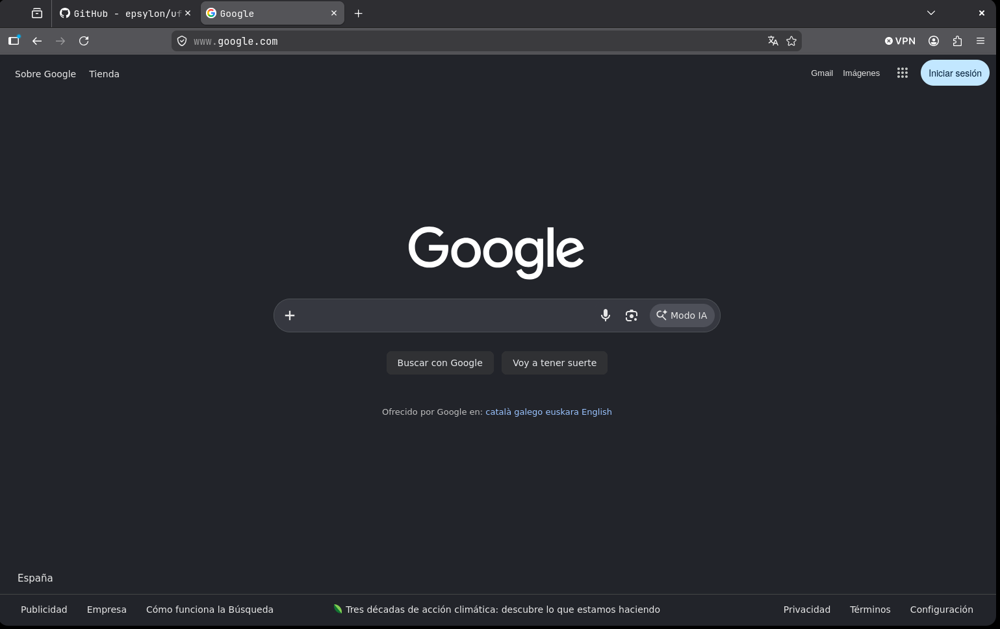

*Writeup educativo en entorno controlado.*
