# Prototype Pollution — Laboratorio de práctica web
**Dificultad:** Media | **SO:** Linux | **Fecha:** 03/10/2026 | **Autor:** krinoxx | **Plataforma:** Laboratorio de práctica web

## Índice
- [Reconocimiento](#reconocimiento)
- [Enumeración web](#enumeración-web)
- [Acceso inicial](#acceso-inicial)
- [Escalada de privilegios](#escalada-de-privilegios)
- [Lecciones aprendidas](#lecciones-aprendidas)
  - [Desde el punto de vista del atacante](#desde-el-punto-de-vista-del-atacante)
  - [Desde el punto de vista del defensor](#desde-el-punto-de-vista-del-defensor)
- [Capturas](#capturas)

## Reconocimiento

El laboratorio consiste en una aplicación web Node.js que se despliega en local. Se clona el repositorio del laboratorio y se accede al módulo correspondiente a la categoría de vulnerabilidad a practicar (*Prototype Pollution*).

Tras instalar las dependencias con `npm install` se levanta el servidor con `npm start`, que arranca mediante `nodemon` y queda escuchando en el puerto **5000**.

## Enumeración web

Con la aplicación arriba, se accede a `http://localhost:5000` y se registra un usuario (`krxx`). Tras iniciar sesión, la aplicación muestra una página de "demostración en vivo" con:

- El usuario autenticado (`You are logged in as krxx`).
- Un campo `Admin:` vacío, es decir, el usuario no tiene privilegios de administrador.
- Un formulario para "enviar un mensaje al admin", con campos `email` y `message`.

Revisando el código fuente del servidor (`index.js`), se localiza el manejador de la ruta `POST /message`:

```js
app.post("/message", validate(postSchema), (req, res) => {
  const obj = _.merge({}, req.body, { ipAddress: req.ip });
  console.log(obj);
  res.redirect("/login");
});
```

El dato relevante es el uso de `_.merge({}, req.body, { ipAddress: req.ip })` de **lodash**. Esta función realiza un *merge* recursivo del objeto body del usuario sin sanear las claves, lo que la hace susceptible a **Prototype Pollution** si el atacante incluye la clave `__proto__` en el JSON enviado: cualquier propiedad definida dentro de `__proto__` queda inyectada en `Object.prototype`, afectando a todos los objetos de la aplicación, no solo al que se está construyendo.

Antes de explotarla, se envía un mensaje normal desde el formulario para observar el comportamiento esperado de `_.merge`: el objeto resultante en consola muestra `email`, `msg` e `ipAddress`, confirmando el flujo de datos del body hacia la función vulnerable.

## Acceso inicial

Con FoxyProxy se enruta el tráfico del navegador hacia Burp Suite para interceptar la petición `POST /message`.

En Burp Repeater se modifica el cuerpo JSON de la petición para incluir, junto a `email` y `msg`, la clave `__proto__` con la propiedad `admin` a `true`:

```json
{
  "email": "test@test.test",
  "msg": "Pruebita",
  "__proto__": {
    "admin": true
  }
}
```

Al enviar la petición, el servidor responde `302 Found` redirigiendo a `/login`, comportamiento normal de la ruta. Sin embargo, el `merge` inseguro ya ha contaminado `Object.prototype` en el proceso Node.js del servidor.

Al recargar `/login`, el campo que antes mostraba `Admin:` vacío ahora muestra:

```
Admin: true
```

Esto confirma que la contaminación del prototipo afecta a cualquier objeto de la aplicación que no defina explícitamente la propiedad `admin` (incluido el objeto de sesión/usuario consultado en esa vista), logrando así una escalada de privilegios lógica sin necesidad de credenciales de administrador ni de modificar la base de datos.

## Escalada de privilegios

No aplica como fase independiente en este laboratorio: la propia explotación de la Prototype Pollution en la capa de aplicación constituye en sí misma la escalada de privilegios (de usuario estándar a `admin: true`), sin que exista un sistema operativo subyacente sobre el que escalar.

## Lecciones aprendidas

### Desde el punto de vista del atacante

- Revisar el código fuente (cuando está disponible) o el comportamiento de la aplicación para detectar funciones de *merge*/*extend* recursivas sobre entradas controladas por el usuario (`_.merge`, `_.merge`, `$.extend`, `Object.assign` recursivo manual, etc.).
- Probar la inyección de claves especiales (`__proto__`, `constructor.prototype`) en cualquier endpoint que acepte JSON y lo combine con un objeto interno.
- Usar un proxy de intercepción (Burp) para manipular el body exacto de la petición, ya que el formulario HTML no permite introducir directamente `__proto__`.
- Verificar el efecto de la contaminación observando cambios de estado en la propia respuesta o en vistas posteriores que dependan de propiedades por defecto de un objeto.

### Desde el punto de vista del defensor

- Evitar hacer *merge* del body de la petición directamente sin sanear claves peligrosas (`__proto__`, `constructor`, `prototype`).
- Actualizar a versiones de `lodash` parcheadas frente a Prototype Pollution, o sustituir `_.merge` por alternativas que no toquen el prototipo (por ejemplo, `Object.assign` superficial combinado con una validación estricta de esquema).
- Validar el body contra un esquema con **allowlist** de propiedades permitidas, rechazando cualquier clave no esperada en vez de aceptar el objeto completo.
- Congelar `Object.prototype` (`Object.freeze(Object.prototype)`) en entornos de producción como capa adicional de mitigación.
- Usar objetos sin prototipo (`Object.create(null)`) para estructuras internas sensibles que no deban heredar de `Object.prototype`.

## Capturas

### 01. Clonación del repositorio del laboratorio
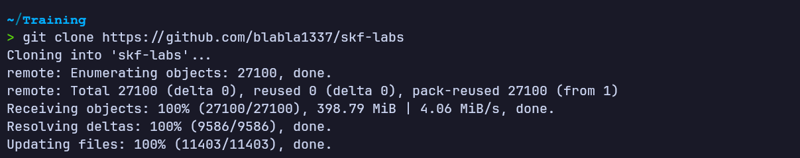

### 02. Navegación hasta el módulo de Prototype Pollution
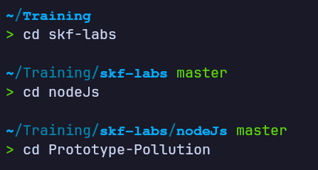

### 03. Instalación de dependencias con npm install
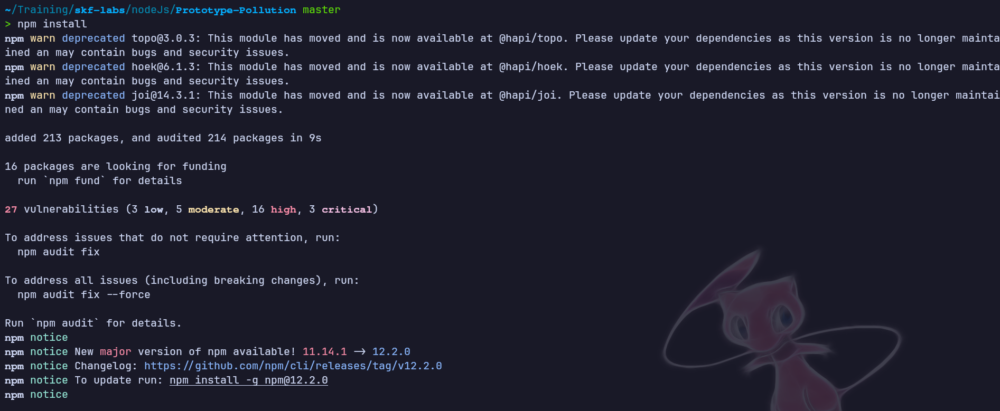

### 04. Arranque del servidor con npm start (puerto 5000)
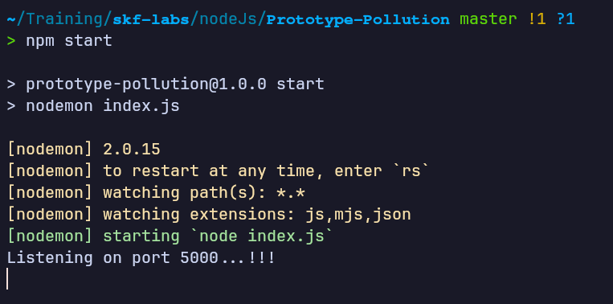

### 05. Registro de usuario en la aplicación
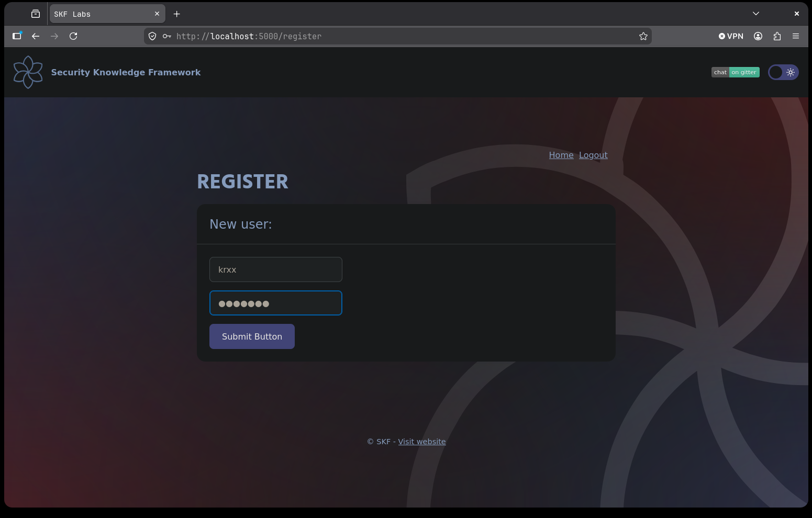

### 06. Login correcto — campo Admin vacío
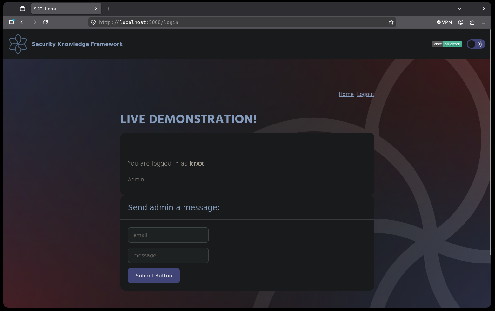

### 07. Apertura del código fuente index.js
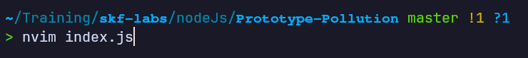

### 08. Handler de POST /message con _.merge inseguro
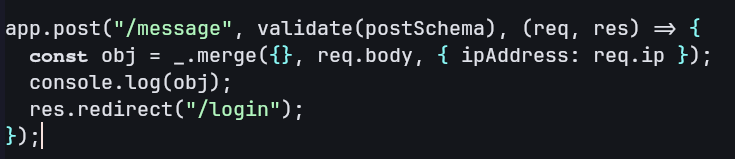

### 09. Envío de mensaje normal desde el formulario
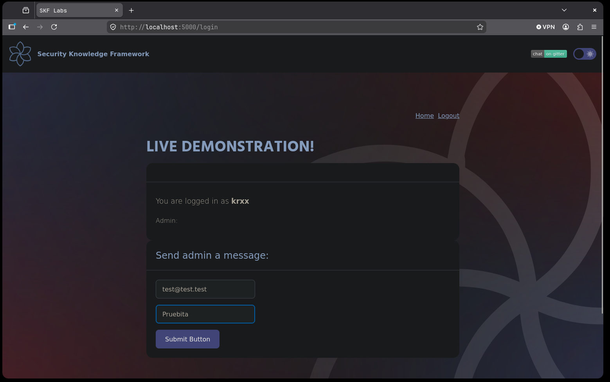

### 10. Objeto resultante en consola tras el merge normal
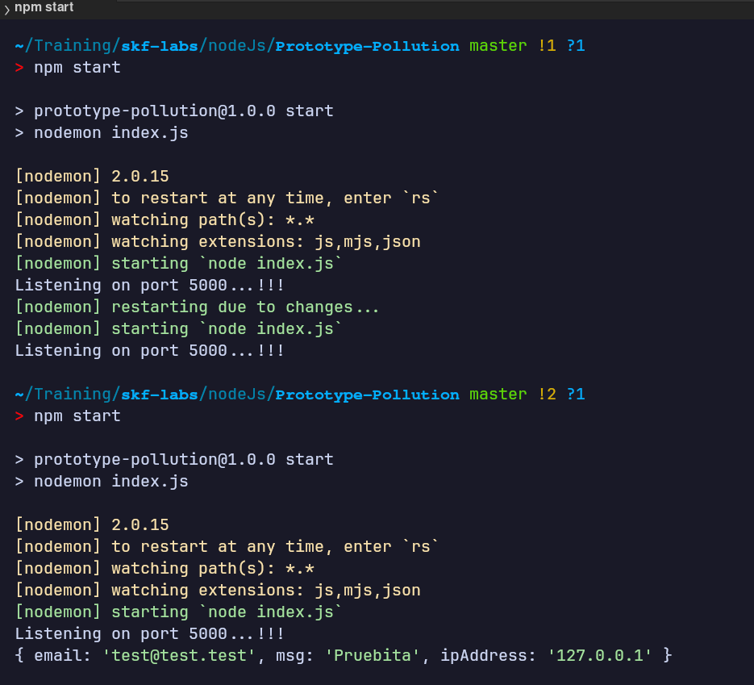

### 11. Activación de Burp Suite vía FoxyProxy
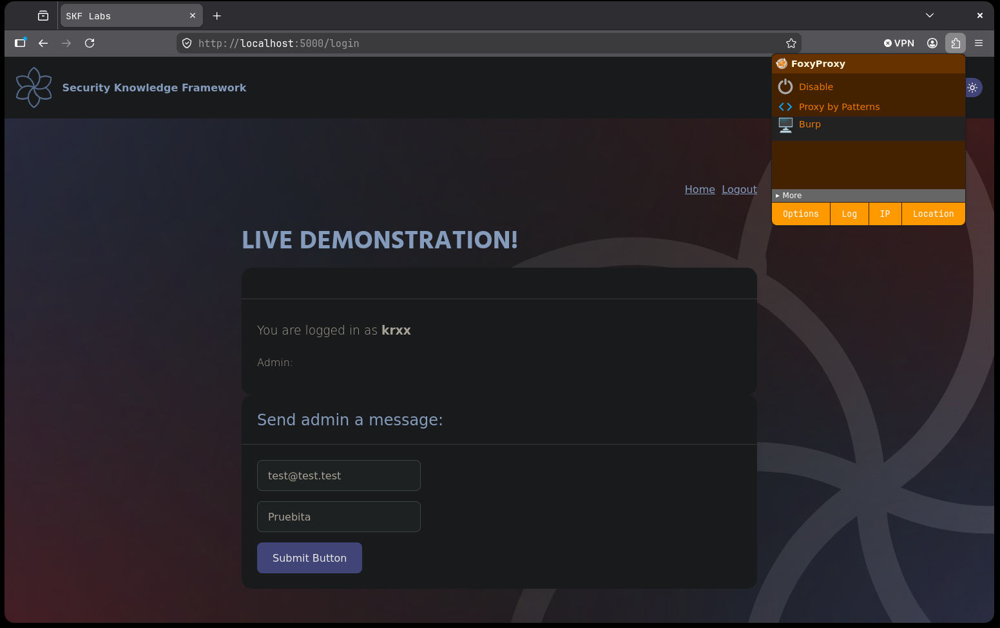

### 12. Inyección de __proto__.admin:true en Burp Repeater
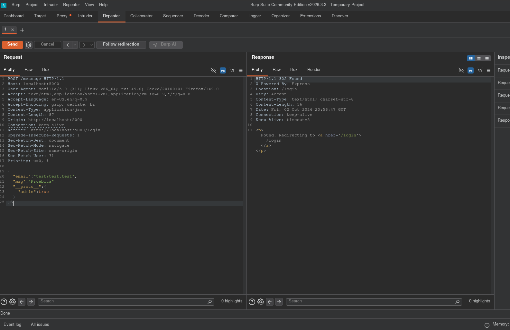

### 13. Confirmación — Admin: true tras la contaminación del prototipo


*Writeup educativo en entorno controlado.*
