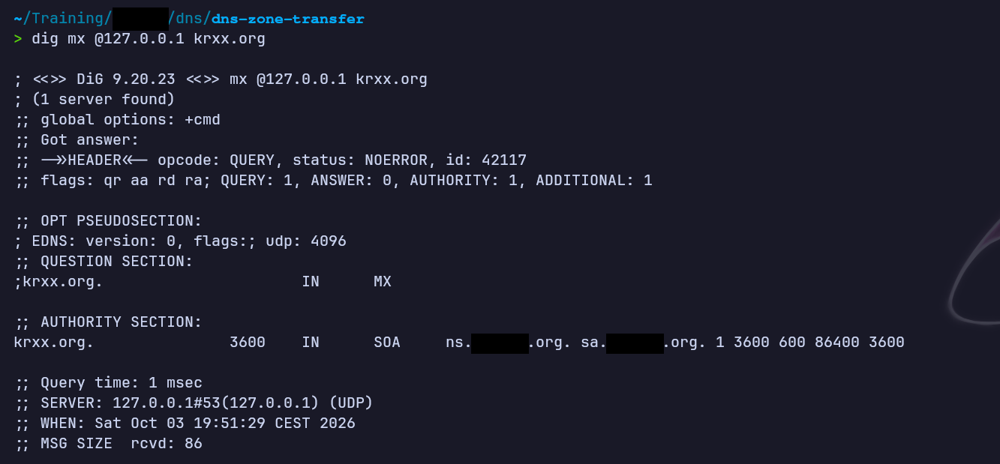
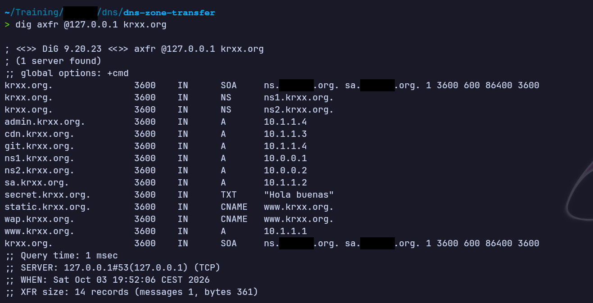
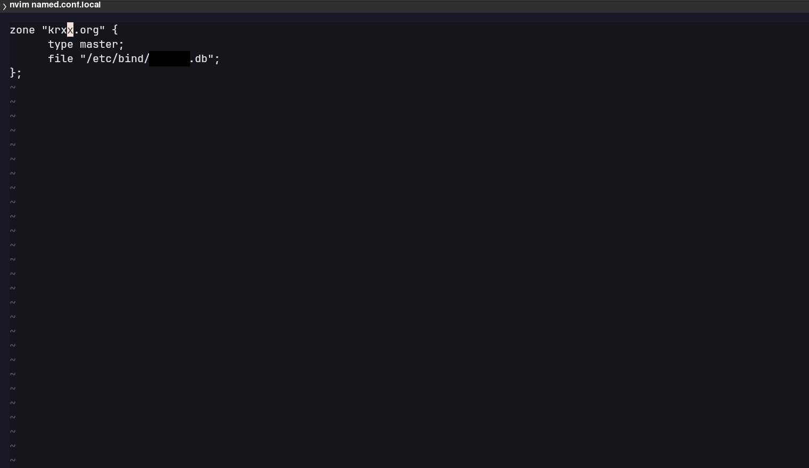
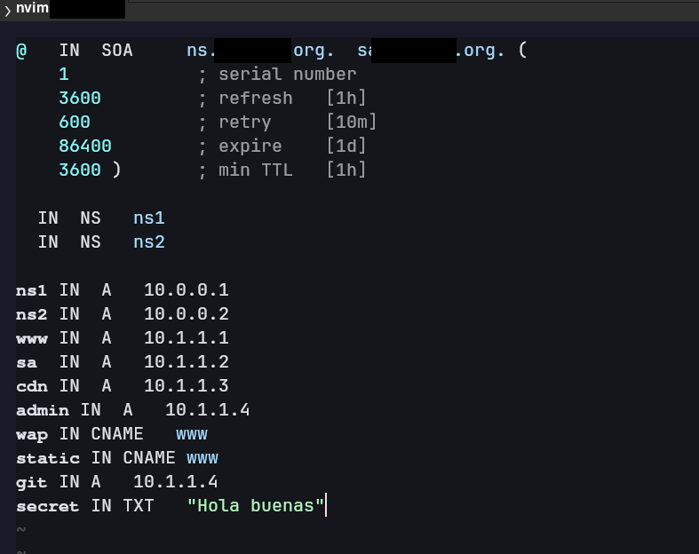

# DNS Zone Transfer — Laboratorio local en Docker
**Dificultad:** Muy fácil | **SO:** Linux (contenedor Docker, BIND) | **Fecha:** 2026-10-03 | **Autor:** krinoxx | **Plataforma:** Laboratorio local de DNS en Docker (entorno controlado)

## Índice
- [Reconocimiento](#reconocimiento)
- [Acceso inicial](#acceso-inicial)
- [Escalada de privilegios](#escalada-de-privilegios)
- [Lecciones aprendidas](#lecciones-aprendidas)
  - [Desde el punto de vista del atacante](#desde-el-punto-de-vista-del-atacante)
  - [Desde el punto de vista del defensor](#desde-el-punto-de-vista-del-defensor)
- [Capturas](#capturas)

## Reconocimiento

El laboratorio levanta un servidor DNS (BIND) en un contenedor Docker, accesible en `127.0.0.1:53`. El dominio de la práctica es `krxx.org`.

Lo primero es comprobar que el servidor responde y que es autoritativo para la zona. Una consulta de tipo MX sirve para ello:

```bash
dig mx @127.0.0.1 krxx.org
```

Qué se observa en la respuesta (captura 1):

- `status: NOERROR` y el flag `aa` (authoritative answer): el servidor es autoritativo para `krxx.org`.
- `ANSWER: 0`: el dominio no tiene registros MX.
- En la sección `AUTHORITY` aparece el registro SOA de la zona.

## Acceso inicial

Con un servidor autoritativo identificado, se solicita una transferencia completa de zona (AXFR). Esta operación va sobre TCP y está pensada para que los servidores secundarios repliquen la zona del primario:

```bash
dig axfr @127.0.0.1 krxx.org
```

El servidor entrega la zona completa sin pedir ningún tipo de autenticación (captura 2): **14 registros, 361 bytes, en un único mensaje**.

| Registro | Tipo | Valor |
|---|---|---|
| `krxx.org.` | SOA / NS | `ns1.krxx.org.`, `ns2.krxx.org.` |
| `ns1.krxx.org.` | A | 10.0.0.1 |
| `ns2.krxx.org.` | A | 10.0.0.2 |
| `www.krxx.org.` | A | 10.1.1.1 |
| `sa.krxx.org.` | A | 10.1.1.2 |
| `cdn.krxx.org.` | A | 10.1.1.3 |
| `admin.krxx.org.` | A | 10.1.1.4 |
| `git.krxx.org.` | A | 10.1.1.4 |
| `static.krxx.org.` | CNAME | `www.krxx.org.` |
| `wap.krxx.org.` | CNAME | `www.krxx.org.` |
| `secret.krxx.org.` | TXT | `"Hola buenas"` |

Con una sola consulta se obtiene el mapa completo de la infraestructura del dominio: nombres internos, direccionamiento, subdominios sensibles (`admin`, `git`) y un registro TXT con contenido que no debería estar en una zona expuesta.

### Causa raíz

Revisando la configuración del servidor dentro del laboratorio:

- En `named.conf.local` la zona está declarada como `type master` y **no existe ninguna restricción de transferencia** (`allow-transfer`), captura 3.
- El fichero de zona contiene exactamente los registros obtenidos por AXFR, incluido el TXT `secret`, captura 4.

## Escalada de privilegios

No aplica. El objetivo del laboratorio es la fuga de información por transferencia de zona y se completa en la fase anterior.

## Lecciones aprendidas

### Desde el punto de vista del atacante

- Antes de lanzar fuerza bruta de subdominios, probar **AXFR contra cada servidor NS** del dominio. Si funciona, entrega la zona entera en una sola consulta.
- Una consulta sencilla (MX, SOA, NS) confirma si el servidor es autoritativo (flag `aa`) antes de pedir la transferencia.
- Los registros obtenidos permiten priorizar objetivos: subdominios como `admin` o `git`, y qué hosts comparten IP (aquí `admin` y `git` apuntan a la misma).
- Los registros TXT pueden contener información útil; conviene leerlos siempre.

### Desde el punto de vista del defensor

- Restringir las transferencias con `allow-transfer` solo a las IP de los servidores secundarios legítimos. Mejor aún, firmar las transferencias con **TSIG**.
- Limitar el acceso TCP/53 a nivel de firewall: solo los secundarios deberían poder conectarse.
- No guardar información sensible en registros DNS (TXT, nombres que revelen funciones internas) que puedan ser públicos.
- Separar la zona interna de la pública (split DNS) para no exponer direccionamiento privado.
- Registrar y alertar los intentos de AXFR desde orígenes no autorizados.
- Comprobar periódicamente desde fuera de la red que la zona no se puede transferir.

## Capturas

### 1. Consulta MX: el servidor es autoritativo


### 2. Transferencia de zona completa (AXFR)


### 3. Configuración de la zona sin restricción de transferencia


### 4. Fichero de zona con los registros expuestos


---

*Writeup educativo en entorno controlado.*
